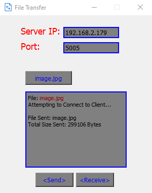

# Graphical-File-Transfer
A Graphical File Transferring Program written in Python 3.9 utilizing the PyQt5 library.

Supported Operating Systems:
Windows & Linux (Not tested on MacOS)

[!] Required Library:
PyQt5 - 'pip install PyQt5' (python3.9)

